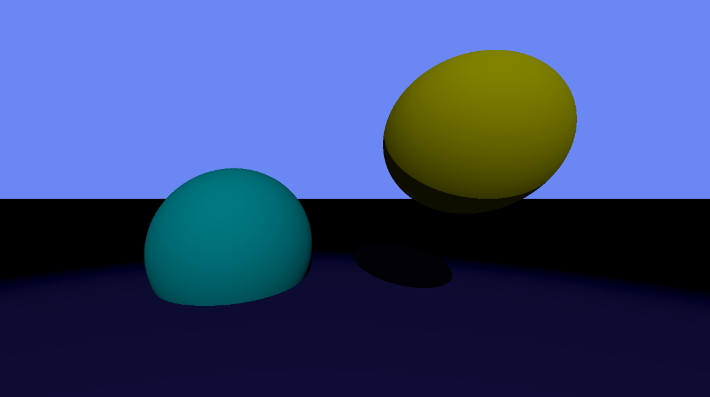

# ☄️ - Raytracer



## - Créateurs

- Killian COTTRELLE
- Clément BARRIER
- Sonny FOURMONT

## 🧐 - Qu'est-ce qu'un raytracer

Un raytracer est un programme informatique qui simule la façon dont la lumière se propage dans une scène tridimensionnelle, en suivant le trajet des rayons lumineux à partir de la caméra virtuelle, permettant ainsi de générer des images réalistes.

## 📝 - Pré-requis

Avant d'installer et d'utiliser ce raytracer, assurez-vous d'avoir les éléments suivants installés sur votre système :

- **git**: Un système de gestion de versions pour cloner le dépôt.
- **g++**: Un compilateur C++ pour compiler le code source.
- **Make**: Un utilitaire de gestion de compilation pour faciliter le processus de construction.
- **libconfig++-dev**: Une bibliothèque C++ pour la lecture et l'écriture de fichiers de configuration.

## 🛠️ - Installation

Pour installer ce raytracer, vous devez executer cette commande :

```bash
bash -c "$(curl -fsSL https://raw.githubusercontent.com/Krio18/RayTracer/main/Installation.sh)"
```

Flags:
```bash
  -u        Met à jour le projet.
  -d        Supprime le projet.
  -h        Affiche cette aide.
```

## 🚀 - Lancement du raytracer

#### **Attention** ce raytracer ne fonction qu'à l'interieur de son dossier !**

Pour lancer le raytracer avec une scène spécifique, utilisez la commande suivante :

```bash
./Raytracer scenes/<NOM_DU_FICHIER_DE_SCENE>
```

Un fichier nommer "output.ppm" sera alors generer, celui-ci contiendra votre image.

## ⚙️ - Choix de la configuration

Le moteur de raytracing peut être configuré en utilisant différents fichiers de configuration disponibles dans le dossier "scenes". Voici une description de chaque fichier de configuration disponible :

| Configuration                      | Description                                                                                           |
|------------------------------------|-------------------------------------------------------------------------------------------------------|
| `two_spheres_1_plane.cfg`          | Configuration basique avec 2 sphères et 1 plan.                                                       |
| `a_new_foe_has_appeared.cfg`       | Configuration surprise avec un personnage haut en couleurs !                                          |

## 🖍️ - Créer une configuration

Pour créer un nouveau fichier de configuration, créez un fichier dans le dossier `scenes/` avec l'extension `.cfg`.

```bash
$> touch scenes/newConf.cfg
```
Le format `cfg` étant très exigeant, nous allons devoir créer des sections, des clés et des valeurs.

**Attention** cette fonctionnaliter etait en core du developpment lors de la mise en pause du projet, certaines configuration comm ela modification de la lumiere
via un fichier `cfg` ne sont pas encore disponible.

### 🏛️ - Normes .cfg

Une section est un ensemble de clés et de valeurs. Une section est définie par des deux-points `:` ainsi que des crochets `{}` et le nom de la section. Par exemple `camera:` est une section.

Cette section contient des clés et des valeurs. Par exemple `fieldOfView` est une clé et à pour valeur `70`

```
🚨 Attention 🚨
Les sections sont sensibles aux fautes de frappes et aux conventions.
Par exemple `camera` est différent de `Camera`, ou encore `camera` est différent de `camera:`
Il est aussi très important que TOUTES les *clés* et *valeurs* doivent être séparées par un *=* et un *espace*. Par exemple `fieldOfView=100` n'est pas valide, il faut `fieldOfView = 100`
Il faut également que toutes les *clés* et *valeurs* mentionnées dans cette page soit présentent dans votre fichier de configuration. Sinon, votre fichier de configuration ne sera pas valide. Et vous allez alors rencontré des problèmes de rendu lors de l'execution de votre programme.
Enfin, les toutes les valeurs, exceptés celles de la résolution doivent être sous le format "1.0" soit en valeurs floatantes. Utiliser des valeures entières peut donner lieu à des erreurs de compilation.
```

### 📢 - Sections obligatoires

```ini
# Configuration de la caméra
camera :
{
    resolution = { width = 1920; height = 1080; };
    position = { x = 0.0; y = -100.0; z = 20.0; };
    rotation = { x = 0.0; y = 0.0; z = 0.0; };
    fieldOfView = 72.0; # In degree
};


# Primitives dans la scene
primitives :
{
    # Liste des sphères
    spheres = (
        { x = 0.5; y = 0.2; z = -0.75; r = 0.25; color = { r = 255.0; g = 255.0; b = 0.0; };},
        { x = -0.5; y = -0.30; z = -1.5; r = 0.5; color = { r = 0.0; g = 235.0; b = 255.0; };}
    ) ;
    # Liste des plans
    planes = (
        { axis = "Z"; position = -0.5; color = { r = 64.0; g = 64.0; b = 255.0; }; }
    ) ;
};

# Configuration des lumières
lights :
{
    ambient = 0.4; # Multiplicateur de lumière ambiante
    diffuse = 0.6; # Multiplicateur de lumière diffuse

    # Liste de points de lumière
    point = (
        { x = 0.0; y = 2.0; z = 2.0; }
    ) ;
};
```